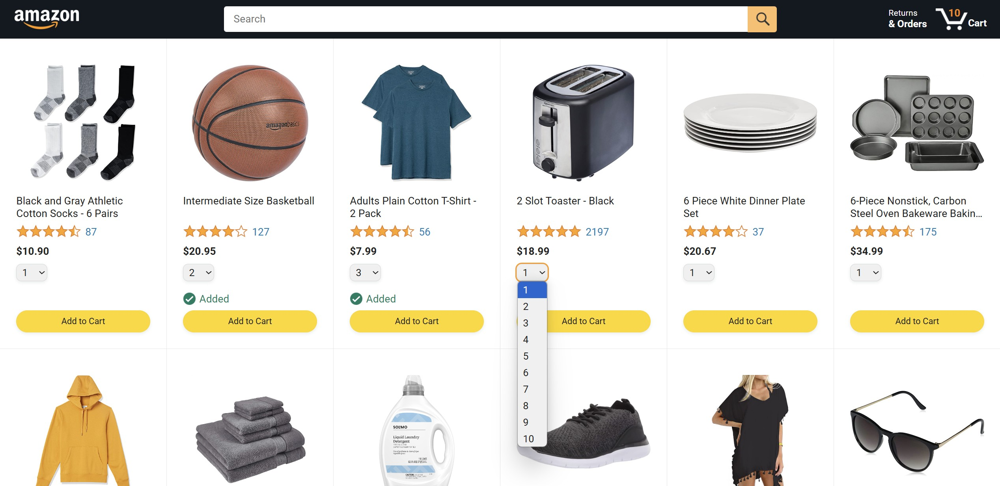
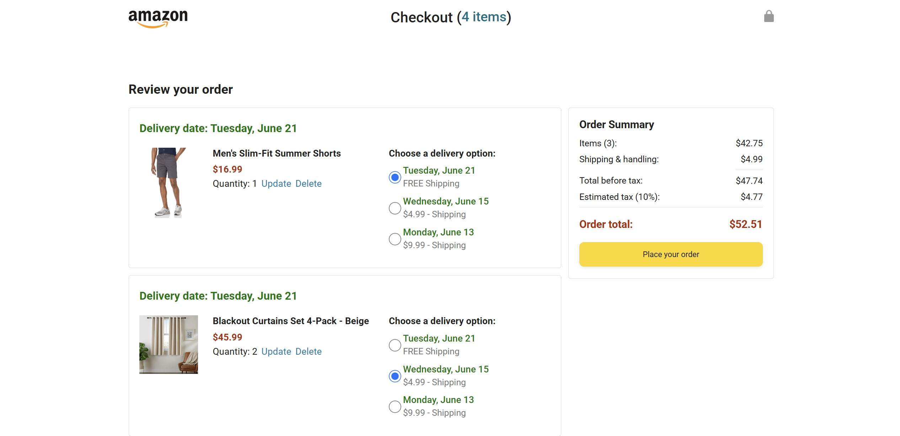

# Amazon Clone - A JavaScript Learning Project

This project is a simplified clone of the Amazon e-commerce website, built as my first project after learning the fundamentals of JavaScript. It was created as part of the JavaScript course by **SuperSimpleDev** on YouTube.

## Demo

## Screenshots

 

## About The Project

This was the first project I created after completing the [SuperSimpleDev JavaScript course](https://youtu.be/EerdGm-ehJQ?si=R0WpX0iO95oGE8FC). The primary goal was to apply my newfound knowledge of JavaScript to build a functional, albeit basic, e-commerce experience.

The front-end UI and styling were provided by the course, and I wrote the JavaScript code to bring the website to life. This includes features like displaying products, adding items to a cart, and managing the checkout process.

## Features

*   **Product Listing:** Displays products dynamically from a data file on the homepage.
*   **Shopping Cart:** Users can add items to the shopping cart. The cart quantity updates dynamically.
*   **Checkout:** A checkout page that summarizes the items in the cart.
*   **Orders Page:** A page to view past orders.
*   **Tracking Page:** A page to track the delivery of an order.

## Technologies Used

*   HTML
*   CSS
*   JavaScript

## Technical Implementation

This project, while simple in its scope, demonstrates several key front-end development concepts:

*   **Modular Design with ES6 Modules:** The JavaScript code is organized into modules (`cart.js`, `products.js`, `amazon.js`, etc.) using ES6 `import`/`export` syntax. This separates concerns, making the code more maintainable and easier to understand. For example, `cart.js` handles all logic related to the shopping cart, while `products.js` acts as a mock database for product data.

*   **Data Management with LocalStorage:** The shopping cart is persisted across browser sessions using the `localStorage` API. The cart data is stored as a JSON string and parsed on page load, providing a seamless user experience.

*   **Dynamic UI Rendering:** The product grid on the homepage and the items in the checkout page are rendered dynamically using JavaScript. The code iterates through the product and cart data arrays, generates the corresponding HTML, and uses `innerHTML` to inject it into the DOM.

*   **Event-Driven Programming:** The application responds to user interactions (like clicking "Add to Cart" or "Delete") using DOM event listeners. These listeners trigger functions that update the application's state (e.g., modifying the cart array) and re-render the necessary parts of the UI.

## My Learning Journey

This project marks a significant milestone in my programming journey. It represents the transition from learning theoretical concepts to applying them in a practical, hands-on manner. While the project is not a full-fledged Amazon replica, it successfully implements the core logic of an e-commerce site and served as a great confidence booster.

I have uploaded this project to my GitHub to showcase my learning arc and my ability to write functional JavaScript code. I plan to continue working on this project to add more features and refine the existing ones.

## Acknowledgements

*   A huge thank you to **SuperSimpleDev** for the excellent and easy-to-understand JavaScript course.
*   The HTML and CSS for this project were adapted from the resources provided by SuperSimpleDev. 